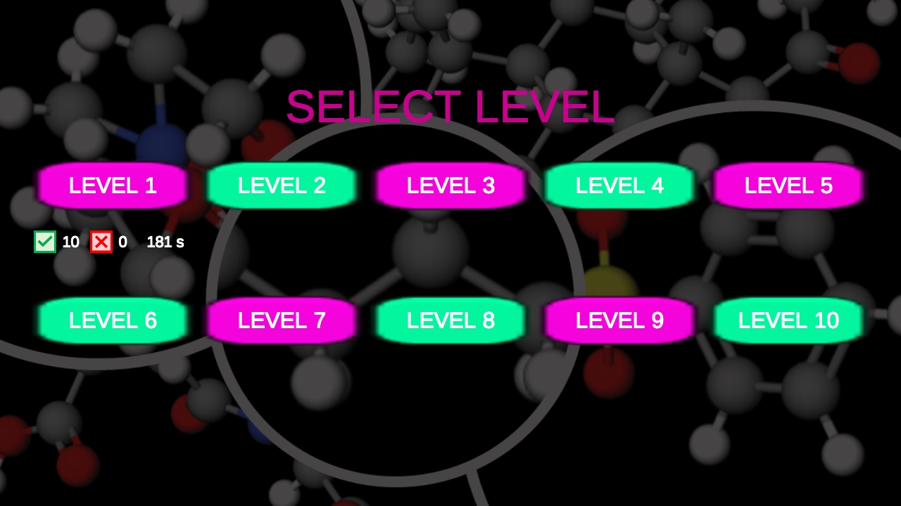
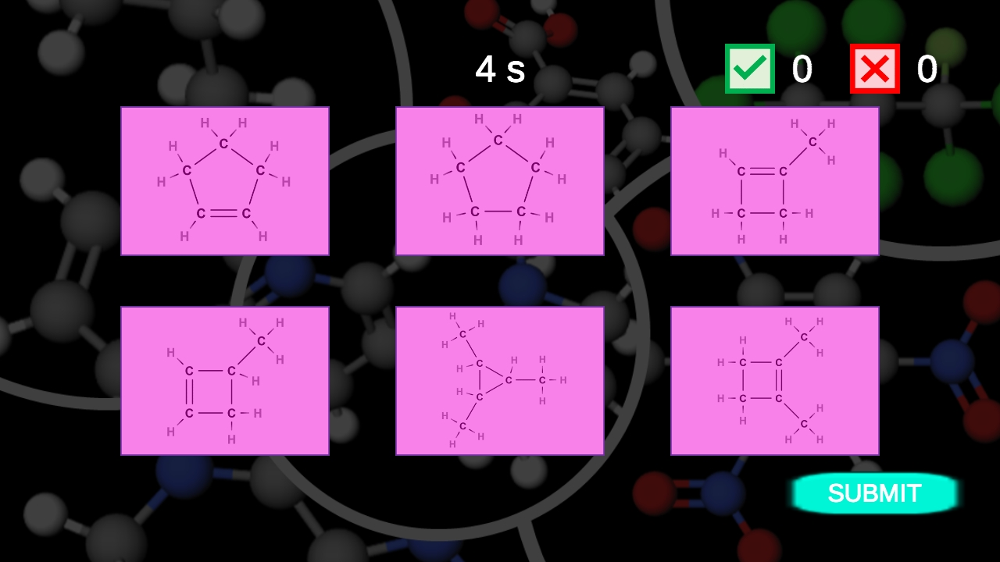
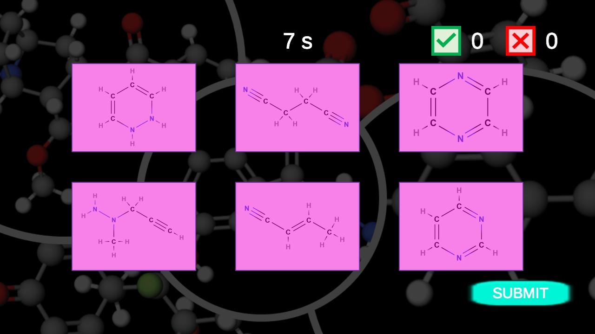
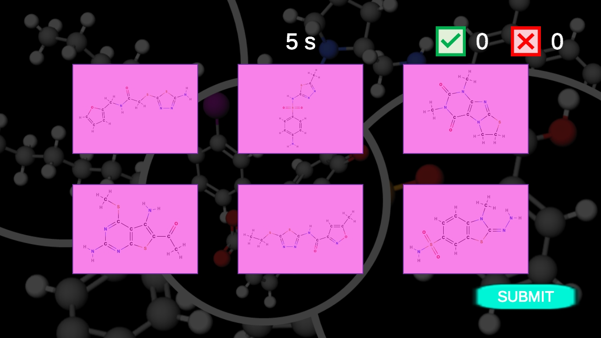
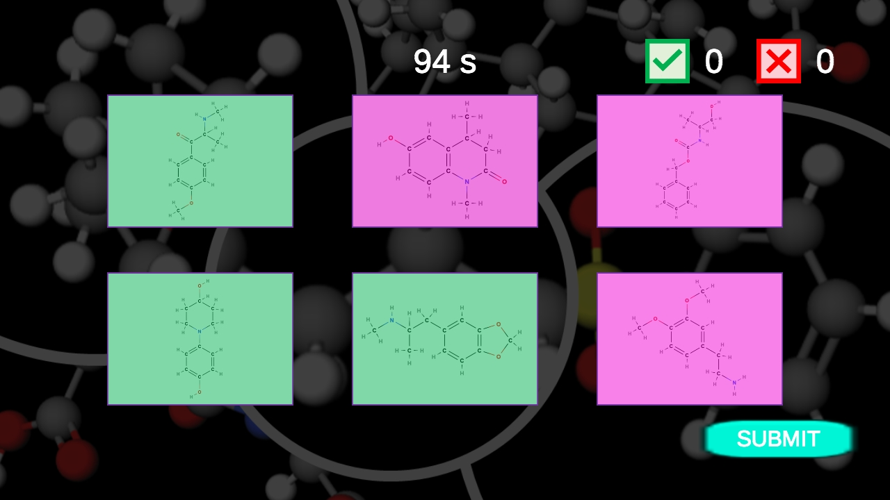

# Isomers - Game: An Organic Chemistry Learning Game

Welcome to Isomers - Game, an engaging web-based learning tool designed to help you practice identifying isomers from structural formulas! This game is tailored for students and enthusiasts of organic chemistry, providing a fun and interactive way to enhance your understanding of isomerism.

## Game Overview

In each game task, players are presented with six structural formulas, three of which are isomers of each other. Your objective is to select the correct three structural formulas that represent the isomers. This exercise will help you sharpen your skills in recognizing and differentiating between various isomeric forms.

## Features

- Isomer Identification: Challenge yourself to identify isomers from a set of structural formulas, enhancing your understanding of organic compounds.
- Multiple Levels: The game consists of ten levels, each containing ten tasks. As you progress, the complexity of the tasks increases, providing a gradual learning curve.
- Interactive Gameplay: Enjoy a user-friendly interface that makes learning about isomerism both fun and educational.

## How to Play

- Start the game and select a level.
- Review the six structural formulas presented to you.
- Identify and select the three correct isomeric structures.
- Complete all ten tasks in each level to advance to the next one.

## Objective

The goal of Isomers - Game is to make learning about isomerism in organic chemistry enjoyable and effective. By practicing with real structural formulas, you will develop a deeper understanding of the concept of isomerism and its significance in organic chemistry.

## Additional Information

If you have any questions, feedback, or suggestions regarding the game, please feel free to reach out to the project maintainer or open an issue on GitHub.

Enjoy playing and learning about isomers!

## Screenshots

## Also available for Android devices

